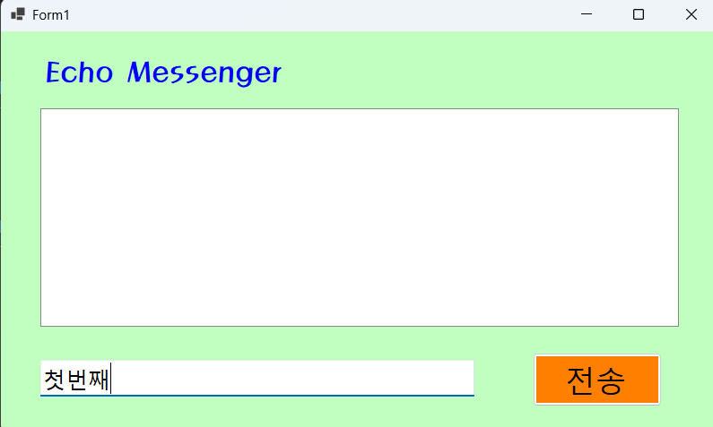
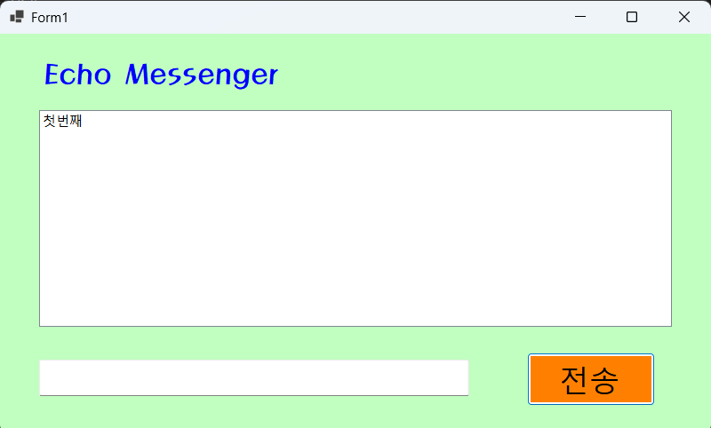
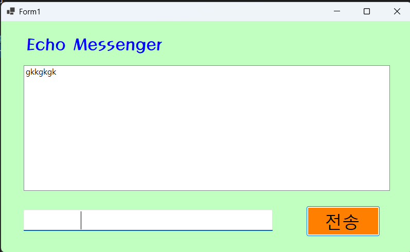
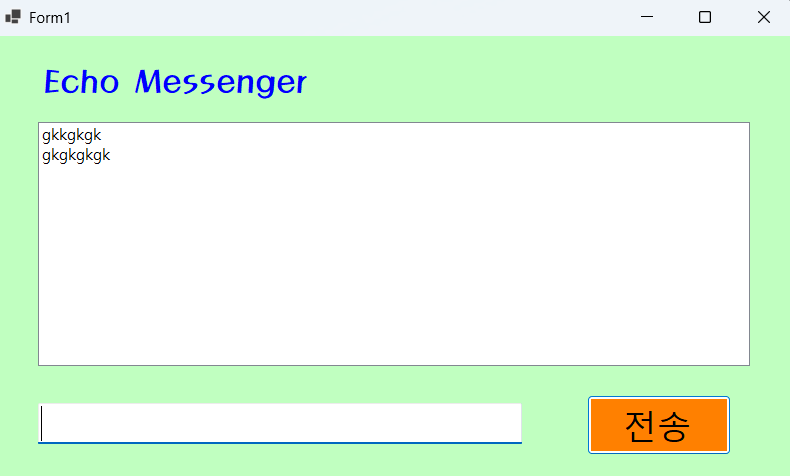
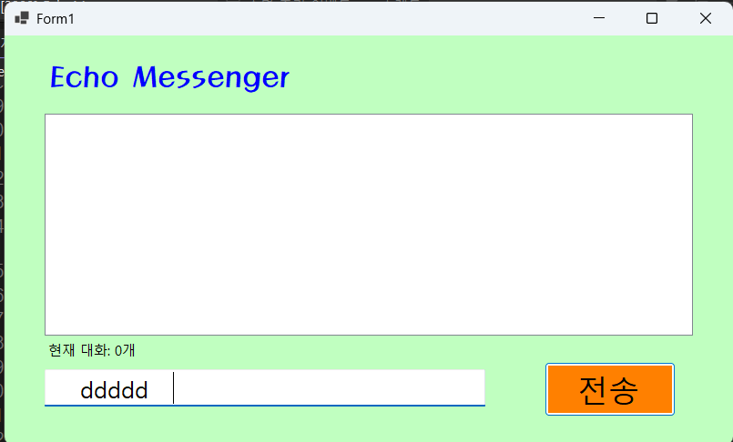
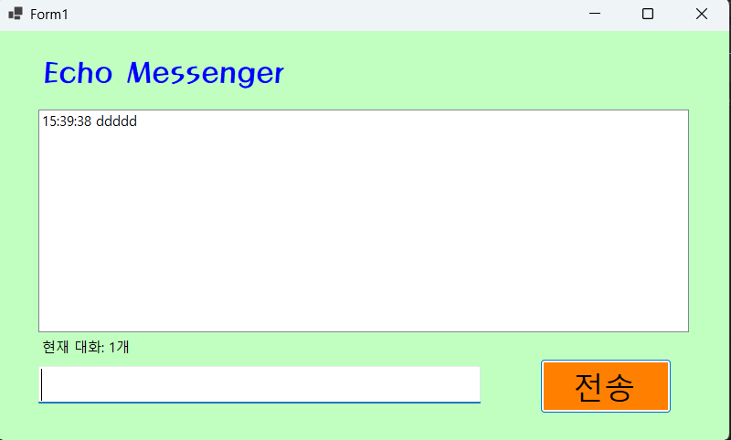

# (C# 코딩) 에코 메신저

## 개요
- C# 프로그래밍 학습
- 1줄 소개: 사용자 키보드 입력을 받아서 처리하는 프로그램입니다.
- 사용한 플랫폼:
	- C#, .NET Windows Forms, Visual Studio, GitHub
- 사용한 컨트롤:
	- Label, TextBox, ListBox, Button
- 사용한 기술과 구현한 기능:
	- Visual Studio를 이용하여 UI 디자인
	- string 클래스를 이용한 사용자 입력 데이터 처리

## 실행 화면 (과제1)
- 과제1 코드의 실행 스크린샷

- 과제 내용
	- Label(표시), TextBox(입력), Button(전송), ListBox(대화창)를 적절히 배치합니다.- 전송 버튼 클릭 시 TextBox의 텍스트를 ListBox의 항목(Items)으로 추가합니다.
	- 추가 직후 TextBox의 내용을 비워(Clear) 다음 입력을 준비합니다.
- 구현 내용과 기능 설명
	- 입력창에 메시지 입력하고 전송 버튼을 누르면 메시지가 리스트 박스에 표시됩니다.
	- 직후 텍스트박스에 내용이 사라집니다.
	- 계속 반복하면 메시지가 리스트 박스에 한 줄씩 계속 추가됩니다.
	- 추가 내용이 많아지면 리스트 박스에 스크롤바가 자동으로 생기고 스크롤된다.

	## 실행 화면 (과제2)
- 과제2 코드의 실행 스크린샷

- 과제 내용
	- 추가 직후 TextBox의 내용을 비워(Clear) 다음 입력을 준비합니다.
	- 엔터키 눌렀을때 전송되는 기능이 추가되었습니다.
- 구현 내용과 기능 설명
	- 전송을 누르면 TextBox의 텍스트가 ListBox에 추가되고 TextBox는 비워집니다.
	- 엔터키를 누르면 TextBox의 텍스트가 ListBox에 추가되고 TextBox는 비워집니다.
	- 공백일경우 다시 입력하도록 합니다.

## 실행 화면 (과제3)
- 과제3 코드의 실행 스크린샷

- 과제 내용
1. 타임스탬프 추가
▶ 메시지 앞에 현재 시간([14:20:05])을 자동으로 결합하여 리스트에 출력합니다. 
2. 메시지 카운팅
▶ 현재 리스트에 쌓인 총 메시지 개수를 계산하여 하단 Label에 실시간으로 업데이트합니다. ▶ 예: "현재 대화: 12개“
3. 문자열 정제
▶ 사용자가 입력한 메시지의 앞뒤 불필요한 공백을 Trim() 함수로 제거하여
- 구현 내용과 기능 설명
1. 메시지 앞에 현재 시간이 자동으로 붙어서 리스트에 출력됩니다. 시간을 저장할 변수를 만들어서 DateTime.Now.ToString("HH:mm:ss")로 현재 시간을 문자열로 변환하여 저장합니다. 그리고 메시지 앞에 [시간] 형식으로 붙여서 리스트에 추가하였습니다.
2. 메시지가 추가될 때마다 리스트에 쌓인 총 메시지 개수를 계산하여 하단 Label에 실시간으로 업데이트합니다. 리스트의 Items.Count 속성을 이용하여 현재 메시지 개수를 가져와서 "현재 대화: {개수}개" 형식으로 Label에 출력하였습니다. 
3. 사용자가 입력한 메시지의 앞뒤 불필요한 공백을 Trim() 함수로 제거하여 리스트에 추가하였습니다. TextBox에서 텍스트를 가져올 때 Trim() 함수를 사용하여 앞뒤 공백을 제거한 후 리스트에 추가하였습니다. 이렇게 하면 사용자가 실수로 입력한 공백이 제거되어 깔끔한 메시지가 리스트에 추가됩니다.